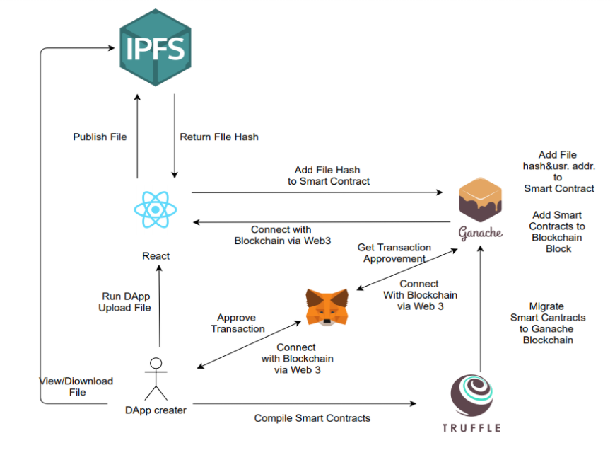
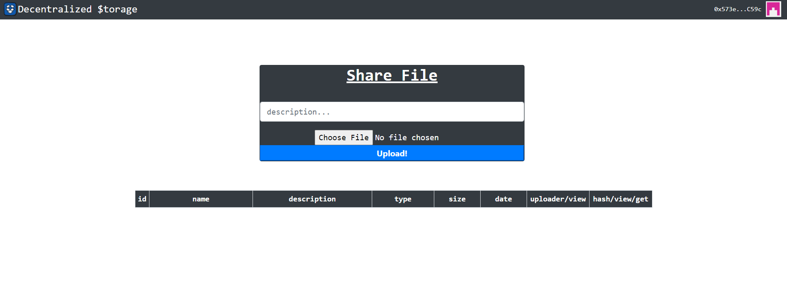
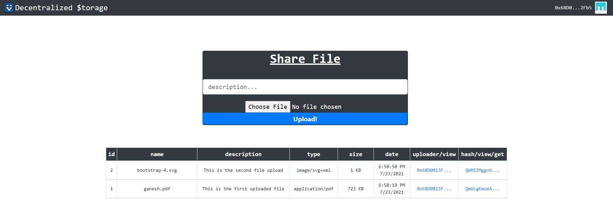
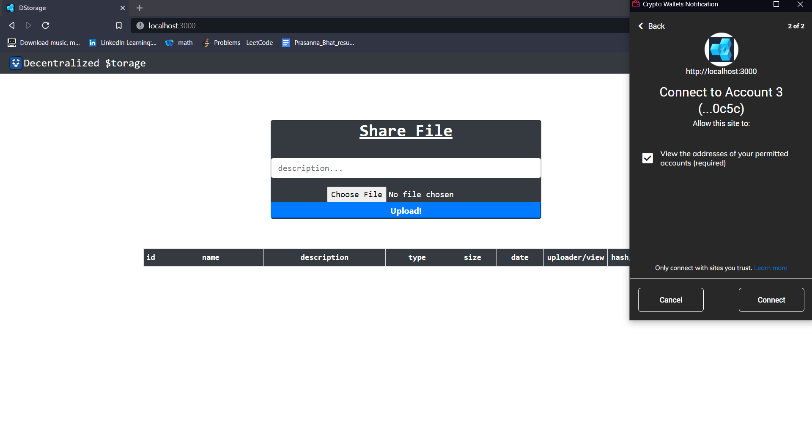

# ``` Dapp - Box 🗳️``` 
### Decentralized File Storage
Data privacy and security are concerns when data resides in third party storage. Storage can be created from the underutilized resources of peers. Data security, privacy, availability, and resource utilization are the areas handled by the proposed system. 


## 🔧 Project Diagram:


## 📸 Screenshots

----

----

----

